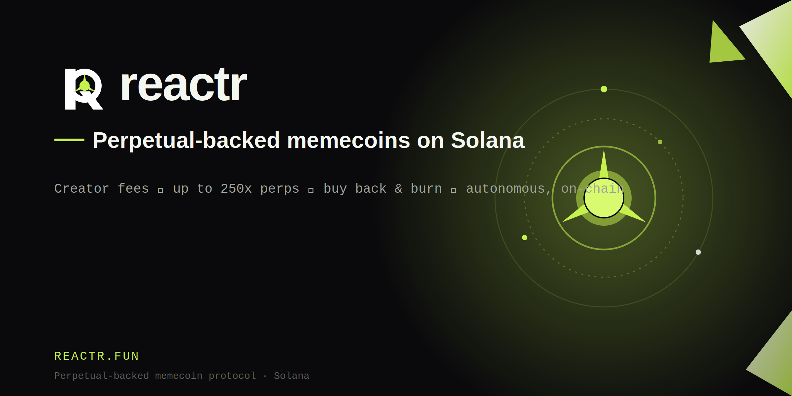

<p align="center">
  
</p>

<p align="center">
  <a href="https://solana.com"></a>
  
  
  
  <br>
  
  
  <a href="LICENSE"></a>
  <a href="https://reactr.fun"></a>
  <a href="https://x.com/reactrfun"></a>
</p>

---

## What is REACTR

**REACTR** turns Pump.fun creator fees into an autonomous trading and buyback engine.
When a token routes **100% of its creator fees** to the core wallet, the engine sweeps
them, splits **70% → leveraged perps / 30% → $REACTR buyback**, harvests profits, and
burns supply. No team withdrawals, no deposits, no off switch.

```
 creator fees ──▶ core wallet ──▶ engine
                                    ├─ 70%  ▶ Jupiter/Flash perps ▶ profit ▶ buy back & burn the token
                                    └─ 30%  ▶ buy back & burn $REACTR
```

<a href="https://reactr.fun">reactr.fun</a> &nbsp;·&nbsp; <a href="https://docs.reactr.fun">docs.reactr.fun</a>

## Repo layout

```
src/
  server.js   Core API (the site talks to this)
  engine.js   Autonomous loop: claim fees → allocate → perp → harvest → buyback → burn
  perps.js    Perp adapter (Jupiter Perps / Flash) — wire before enabling leverage
  jupiter.js  Jupiter swaps (buybacks)
  burn.js     Send tokens to the incinerator (permanent burn)
  verify.js   On-chain checks before a token is registered
  solana.js   RPC connection + core wallet
  store.js    JSON store (swap for Postgres in prod)
  config.js   Env config
```

## API

| Method | Endpoint                        | Purpose                        |
|:------:|---------------------------------|--------------------------------|
| `GET`  | `/api/v1/stats`                 | Aggregate metrics (telemetry)  |
| `GET`  | `/api/v1/tokens`                | All registered tokens          |
| `GET`  | `/api/v1/tokens/:mint/status`   | One token's status + position  |
| `POST` | `/api/v1/tokens/register`       | Register a token               |
| `GET`  | `/health`                       | Health check                   |

Point the site at it: set `CONFIG.API_BASE` in the frontend to this service's URL.

## Quick start

```bash
cp .env.example .env      # fill in RPC_URL + CORE_WALLET_SECRET
npm install
npm start                 # API + engine in one process
# or: npm run worker      # engine only
```

## Deploy (Railway)

1. Push to GitHub, create a Railway project from the repo.
2. Add env vars from `.env.example` (`CORE_WALLET_SECRET` here, **never** in git).
3. Mount a volume and set `DATA_FILE=/data/db.json`.
4. Add your API domain, point `api.reactr.fun` at it.

## Status

**Working:** API + registration, on-chain mint checks, Jupiter buybacks, real burns,
70/30 allocation, and a safe fallback that buys back & burns directly when leverage is off.

**To finish before full leverage is live:**
1. **Perp adapter** (`src/perps.js`) — implement `openLong` / `harvest`, then set `ENABLE_PERPS=true`.
2. **Fee-config verification** (`src/verify.js`) — decode the Pump.fun fee-share account.

> ⚠️ Leveraged perpetuals carry real risk of total loss. Experimental software — run only
> with funds you can afford to lose.

## License

MIT © 2026 Reactr
